# MedSync AI — Snowflake Medication Reminder & Refill PoC


Lightweight proof-of-concept scaffold demonstrating a Snowflake bronze→silver→gold ELT pattern, simple synthetic data generation, and a tiny Streamlit UI for local validation.


Contents

- `data/sample/` — generated sample CSVs (`patients.csv`, `daily_updates.csv`)
- `src/` — Python scripts to generate and simulate sample data
- `snowflake/` — SQL templates for Bronze/Silver/Gold layers and reminder queue
- `streamlit_app/` — minimal Streamlit demo
- `docs/` — architecture and data model notes

Quickstart

1. Install dependencies (recommended in a virtualenv):

```bash
python -m pip install -r requirements.txt
```

2. Generate sample patients:

```bash
python src/generate_data.py
```

This writes `data/sample/patients.csv` (default 50 patients). To change the count, edit the script or call `generate_patient(n)`.

3. Simulate daily updates / events:

```bash
python src/simulate_daily_updates.py
```

This writes `data/sample/daily_updates.csv` containing simulated touchpoints.

4. Run the Streamlit demo locally:

```bash
streamlit run streamlit_app/app.py
```

Snowflake

This repo includes SQL templates to create the database layers and example tables. They are intentionally minimal — adapt to your Snowflake account and run via worksheet or CI:

- `snowflake/00_setup.sql` — environment / schema notes
- `snowflake/01_bronze_tables.sql` — raw ingest tables
- `snowflake/02_load_data.sql` — example COPY commands (staging required)
- `snowflake/03_silver_tables.sql` — curated tables
- `snowflake/04_gold_marts.sql` — aggregated marts
- `snowflake/05_reminder_queue.sql` — reminder queue table
- `snowflake/06_optional_ai_messages.sql` — optional AI templates table

Files and purpose

- `src/generate_data.py` — produces `patients.csv` using `Faker` and `pandas`.
- `src/simulate_daily_updates.py` — creates `daily_updates.csv` with event_time and notes.
- `streamlit_app/app.py` — small Streamlit app that lists sample files and acts as a placeholder UI.

Demo Screenshots

The original README included a set of dashboard screenshots. They are preserved below — add or replace the image files in the repo (`image.png`, `image-1.png`, ...) to show the app visuals. Captions are centered and positioned at the bottom of each image; font-size is slightly reduced for subtlety.

<div>
	<!-- Full-width centered figures with bottom-centered captions -->
	<figure style="position:relative; max-width:1100px; margin:24px auto;">
		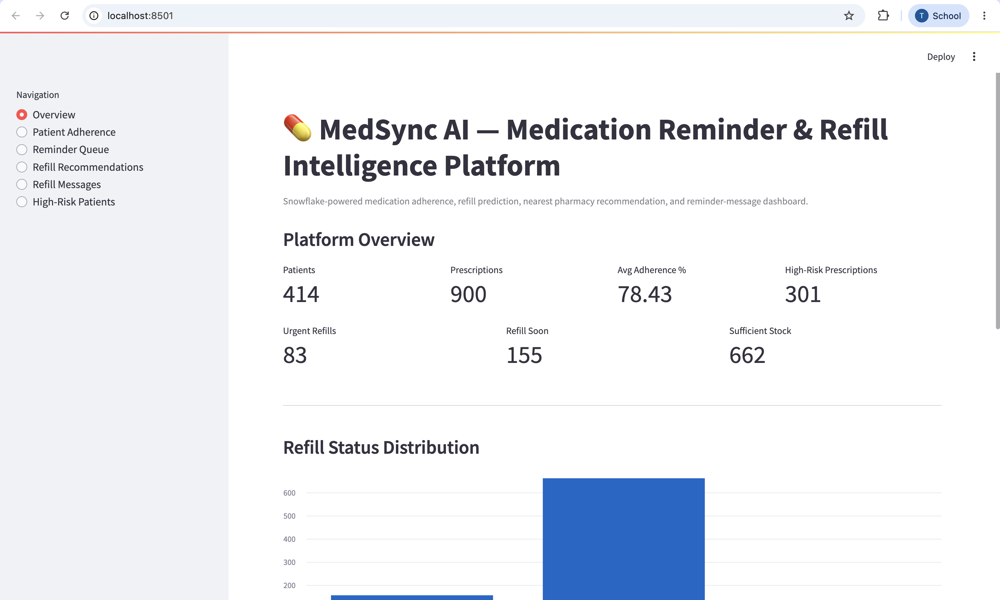
		<figcaption style="position:absolute; left:50%; bottom:18px; transform:translateX(-50%); background:rgba(0,0,0,0.55); color:#fff; padding:6px 10px; border-radius:6px; font-size:0.85rem;"><em>Example home screen for the Streamlit dashboard (placeholder).</em></figcaption>
	</figure>

	<figure style="position:relative; max-width:1100px; margin:24px auto;">
		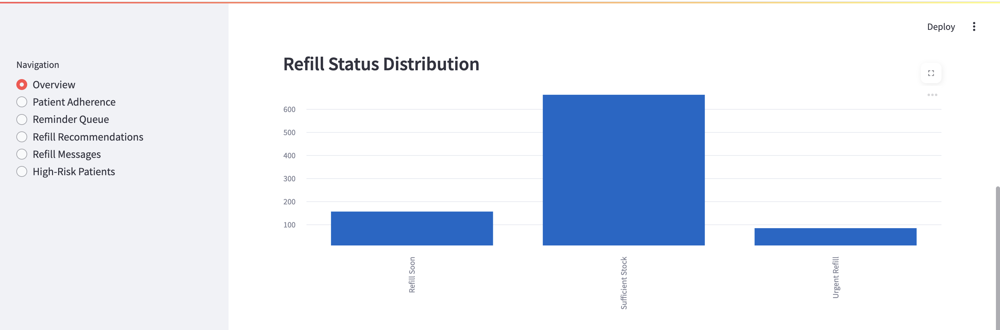
		<figcaption style="position:absolute; left:50%; bottom:18px; transform:translateX(-50%); background:rgba(0,0,0,0.55); color:#fff; padding:6px 10px; border-radius:6px; font-size:0.85rem;"><em>Distribution of refill statuses across patients.</em></figcaption>
	</figure>

	<figure style="position:relative; max-width:1100px; margin:24px auto;">
		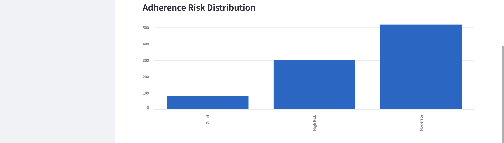
		<figcaption style="position:absolute; left:50%; bottom:18px; transform:translateX(-50%); background:rgba(0,0,0,0.55); color:#fff; padding:6px 10px; border-radius:6px; font-size:0.85rem;"><em>Histogram showing adherence scores.</em></figcaption>
	</figure>

	<figure style="position:relative; max-width:1100px; margin:24px auto;">
		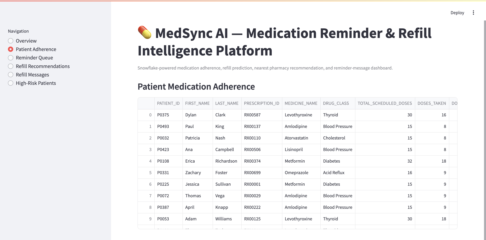
		<figcaption style="position:absolute; left:50%; bottom:18px; transform:translateX(-50%); background:rgba(0,0,0,0.55); color:#fff; padding:6px 10px; border-radius:6px; font-size:0.85rem;"><em>Patient-level adherence timeline.</em></figcaption>
	</figure>

	<figure style="position:relative; max-width:1100px; margin:24px auto;">
		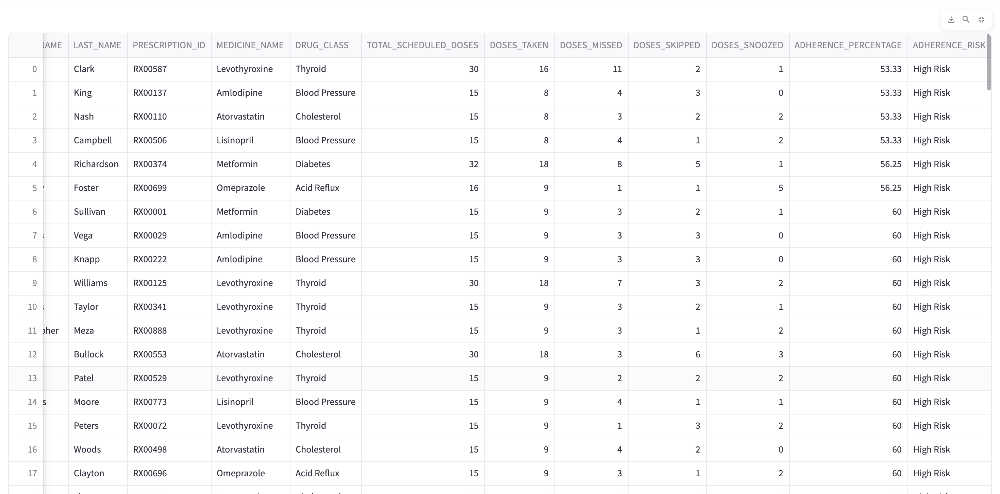
		<figcaption style="position:absolute; left:50%; bottom:18px; transform:translateX(-50%); background:rgba(0,0,0,0.55); color:#fff; padding:6px 10px; border-radius:6px; font-size:0.85rem;"><em>Patient details and notes.</em></figcaption>
	</figure>

	<figure style="position:relative; max-width:1100px; margin:24px auto;">
		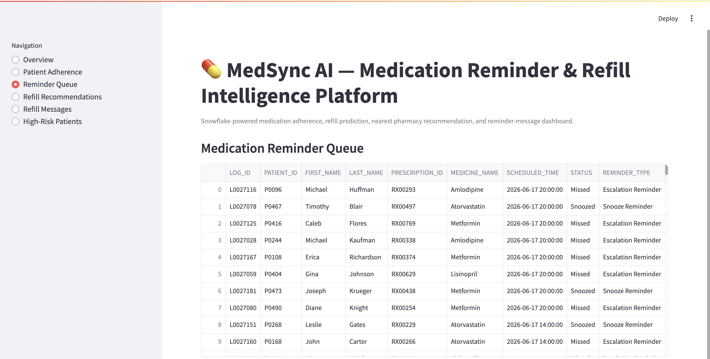
		<figcaption style="position:absolute; left:50%; bottom:18px; transform:translateX(-50%); background:rgba(0,0,0,0.55); color:#fff; padding:6px 10px; border-radius:6px; font-size:0.85rem;"><em>Reminder queue overview.</em></figcaption>
	</figure>

	<figure style="position:relative; max-width:1100px; margin:24px auto;">
		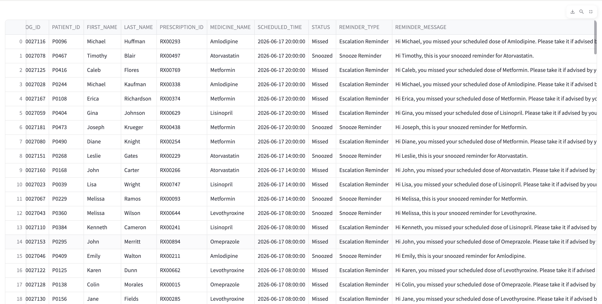
		<figcaption style="position:absolute; left:50%; bottom:18px; transform:translateX(-50%); background:rgba(0,0,0,0.55); color:#fff; padding:6px 10px; border-radius:6px; font-size:0.85rem;"><em>Queue status and message previews.</em></figcaption>
	</figure>

	<figure style="position:relative; max-width:1100px; margin:24px auto;">
		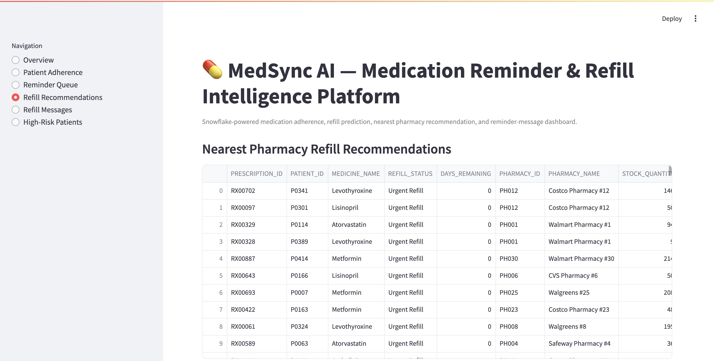
		<figcaption style="position:absolute; left:50%; bottom:18px; transform:translateX(-50%); background:rgba(0,0,0,0.55); color:#fff; padding:6px 10px; border-radius:6px; font-size:0.85rem;"><em>Refill recommendations for patients.</em></figcaption>
	</figure>

	<figure style="position:relative; max-width:1100px; margin:24px auto;">
		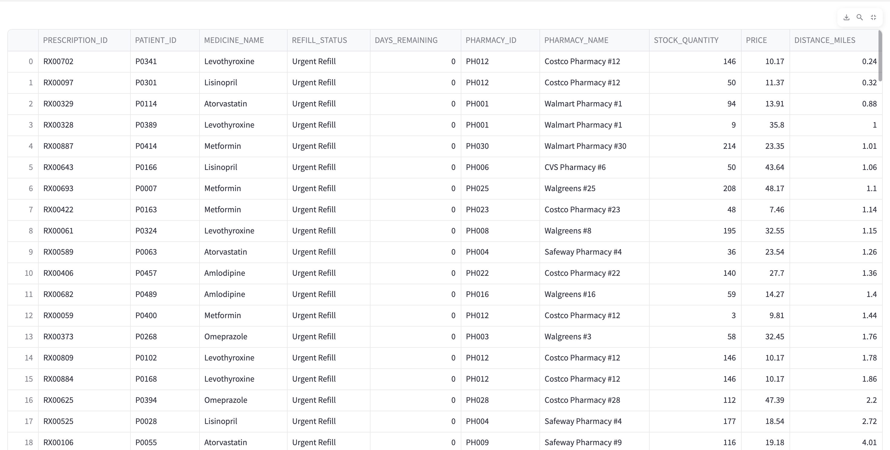
		<figcaption style="position:absolute; left:50%; bottom:18px; transform:translateX(-50%); background:rgba(0,0,0,0.55); color:#fff; padding:6px 10px; border-radius:6px; font-size:0.85rem;"><em>Nearby pharmacy suggestions.</em></figcaption>
	</figure>

	<figure style="position:relative; max-width:1100px; margin:24px auto;">
		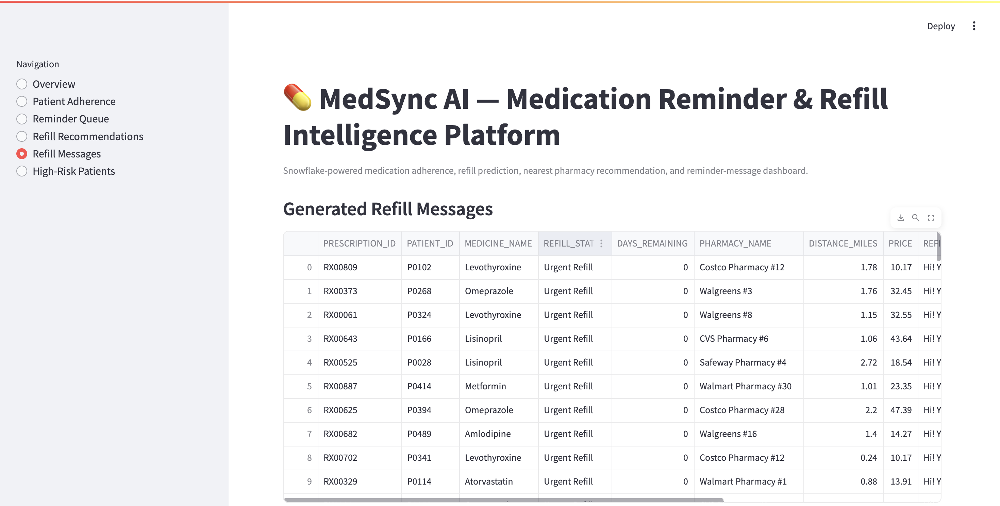
		<figcaption style="position:absolute; left:50%; bottom:18px; transform:translateX(-50%); background:rgba(0,0,0,0.55); color:#fff; padding:6px 10px; border-radius:6px; font-size:0.85rem;"><em>Message templates and AI examples.</em></figcaption>
	</figure>

	<figure style="position:relative; max-width:1100px; margin:24px auto;">
		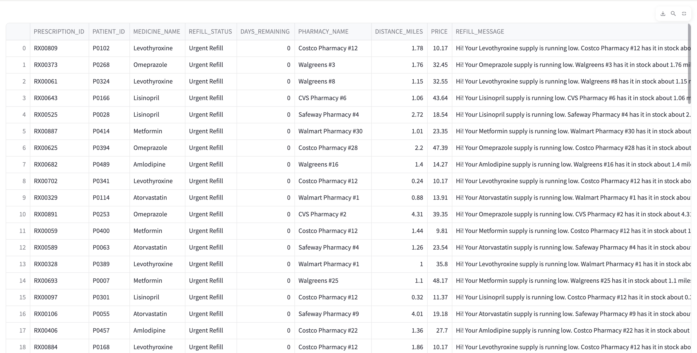
		<figcaption style="position:absolute; left:50%; bottom:18px; transform:translateX(-50%); background:rgba(0,0,0,0.55); color:#fff; padding:6px 10px; border-radius:6px; font-size:0.85rem;"><em>Personalized refill message preview.</em></figcaption>
	</figure>

	<figure style="position:relative; max-width:1100px; margin:24px auto;">
		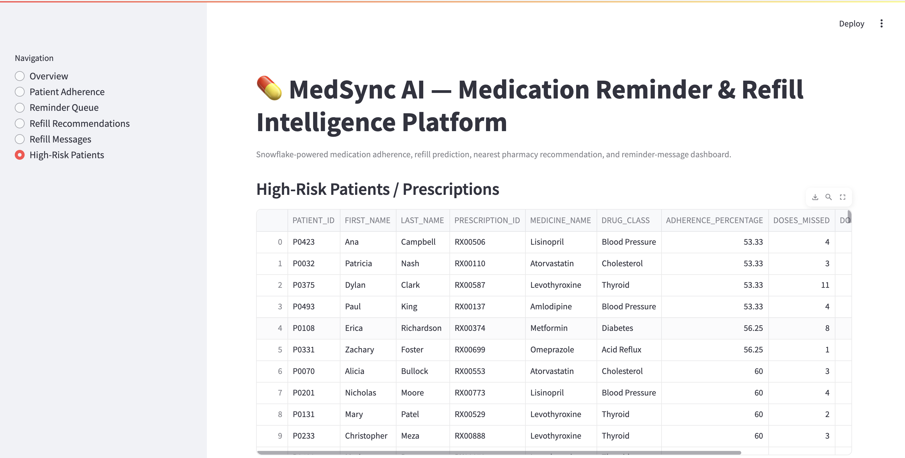
		<figcaption style="position:absolute; left:50%; bottom:18px; transform:translateX(-50%); background:rgba(0,0,0,0.55); color:#fff; padding:6px 10px; border-radius:6px; font-size:0.85rem;"><em>High-risk patient list and action flags.</em></figcaption>
	</figure>

	<figure style="position:relative; max-width:1100px; margin:24px auto 48px;">
		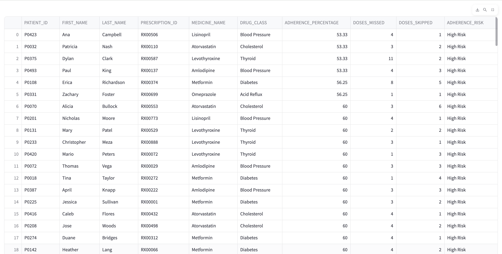
		<figcaption style="position:absolute; left:50%; bottom:18px; transform:translateX(-50%); background:rgba(0,0,0,0.55); color:#fff; padding:6px 10px; border-radius:6px; font-size:0.85rem;"><em>Risk scoring and recent activity.</em></figcaption>
	</figure>

</div>
Notes & Next Steps

- This is a scaffold for experimentation — production deployments require secure credential handling, proper ingestion (Snowpipe/Stream), and compliance reviews before using real PHI.
- If you want, I can: run the sample data generation in this workspace, add a `Makefile` or `run.sh` for convenience, or create a `README` badge with quick run commands.

Future Improvements
- Twilio SMS integration
- Real pharmacy API integration
- dbt transformations
- Snowpipe ingestion
- Snowflake Cortex AI message personalization
- HIPAA-ready consent and audit workflows